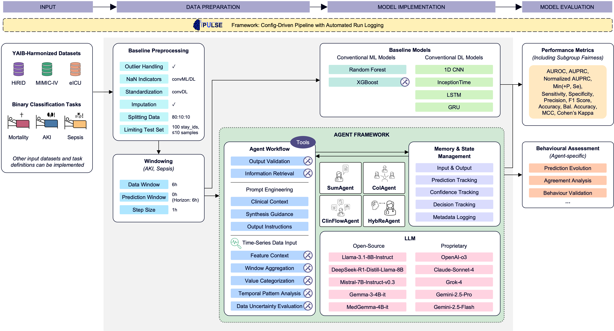

<p align="center">
  
  
  
</p>

# PULSE Agents Framework

PULSE (_<u>P</u>redictive <u>U</u>nderstanding of <u>L</u>ife-threatening <u>S</u>ituations using <u>E</u>mbeddings_) provides a modular framework for agent-based prediction and reasoning on ICU time-series data. This repository focuses on four agents, especially the HybReAgent, for clinical prediction tasks using Large Language Models (LLMs).



---

## Overview

This repository enables agent-based prediction of ICU outcomes (mortality, AKI, sepsis) using a unified framework. Agents encapsulate different reasoning and interaction strategies, leveraging LLMs, ML, and DL models. The framework supports flexible data preparation, agent configuration, and experiment tracking.

### Implemented Agents

| Agent Name                  | Description                                                                                   |
|---------------------------- |----------------------------------------------------------------------------------------------|
| **HybReAgent**              | Hybrid Reasoning Agent: This agent integrates the quantitative predictions of a conventional machine learning model (XGboost) with the qualitative, knowledge-driven reasoning of a Large Language Model to synthesize a final, robust risk estimate. |
| **ClinFlowAgent**   | ClinicalWorkflowAgent: Designed to emulate a clinician's iterative reasoning, this agent progressively acquires and interprets clinical data by first analyzing vital signs and then dynamically deciding which laboratory tests to order and review.                                   |
| **ColAgent** | Collaborative Agent: The ColAgent simulates a multi-disciplinary team by synthesizing independent, confidence-weighted assessments from three virtual domain experts (hemodynamic, metabolic, and hematologic) to form a final prediction.                      |
| **SumAgent**           | Summary Agent: This agent first identifies and summarizes a patient's abnormal features and then uses this concise summary to generate a final prediction (derived from Zhu et al., 2024).                                |

Each agent can be configured for different tasks, datasets, and prompting strategies.

---

### Implemented Models

| Type                | Models                                                                                                      |
| ------------------- | ----------------------------------------------------------------------------------------------------------- |
| **conventional ML** | RandomForest, XGBoost                                                                            |
| **conventional DL** | CNN, InceptionTime, LSTM, GRU                                                                              |
| **LLM**             | **Open-Source:** Llama-3.1-8B, DeepSeek-R1-Distill-Llama-8B, Mistral-7B-Instruct-v0.3, Gemma-3-4B-it, and MedGemma-4B-it; **Proprietary**: OpenAI-o3, Claude-Sonnet-4, Grok-4, Gemini-2.5-Pro, and Gemini-2.5-Flash |

___


## Getting Started

### Installation

1. **Clone the repository:**
   ```bash
   git clone https://github.com/sophiafe/pulse-agents.git
   cd pulse_agents
   ```

2. **Install dependencies:**
   ```bash
   pip install -r requirements.txt
   ```

3. Adjust configs/config_benchmark.yaml

   Default config

   - app_mode: "benchmark"
   - tasks: choose tasks to perform benchmark on
   - dataset: choose datasets to perform benchmark on
   - standardize: true for convDL, fals for convML and LLMs
   - windowing: enabled and window size 6
   - prompting_ids: choose prompting approach (standard prompting or agentic workflow) to perform benchark on and set number of shots where applicable.
   - Load_models: choose models to perform benchmark on. Make sure that standardization method matches the model

   Model specific configs can be adjusted if needed. For propriatary LLMs make sure that the api key name matches to the name set as an environment variable in secrets/.env folder. This will be loaded automatically. For convDL models, the architecture is set in the config.
---

## Data

**Datasets:**

- HiRID (Switzerland, single site)
- MIMIC-IV (US, single-site)
- eICU (US, multi-site)

**Harmonization:**

Variable mapping, artifact removal, unit harmonization, cohort and variable selection was conducted according to the YAIB workflow (https://github.com/rvandewater/YAIB). Resulting cohorts vary between tasks with overlapping stay_ids within a dataset.

---

## Tasks

Task Definitions are in accordance with YAIB (https://arxiv.org/abs/2306.05109).

1. **Mortality**

   - **Task Description**: Binary classification, one prediction per stay, patient status at the end of the hospital stay predicted at 25h after ICU admission
   - **Data Structure**: Hourly data of first 25h of ICU stay for cases and controls, one label per stay_id

2. **Acute Kidney Injury (AKI)**

   - **Task Description**: Binary classification, multiple predictions per stay possible and dependent on data/prediction window setup
   - **Data Structure**: Hourly data and hourly labels, whole ICU stay duration for controls, until 12h after defined AKI onset for cases

3. **Sepsis**
   - **Task Description**: Binary classification, multiple predictions per stay possible and dependent on data/prediction window setup
   - **Data Structure**: Hourly data and hourly labels, whole ICU stay duration for controls, until 12h after defined sepsis onset for cases

---

## Add a new Agent

## Adding a New Agent

1. **Create a new agent class**

   - Place your agent in `src/models/agents/` (see existing agents for templates).
   - Inherit from `PulseAgent` and implement the required methods.

   **Example:**
   ```python
   # filepath: src/models/agents/my_new_agent.py
   from src.models.agents.pulse_agent import PulseAgent

   class MyNewAgent(PulseAgent):
       def process_single(self, patient_data):
           # Implement your agent logic here
   ```

2. **Register the agent in the agent registry**

   - Edit `src/models/agents/__init__.py`.
   - Import your agent and register it with a unique `prompting_id`.

   **Example:**
   ```python
   # filepath: src/models/agents/__init__.py
   try:
       from src.models.agents.my_new_agent import MyNewAgent
       register_agent("my_new_agent_preprocessor", MyNewAgent)
   except ImportError as e:
       logger.warning("Could not import MyNewAgent: %s", e)
   ```

3. **(Optional) Add a custom preprocessor**

   - If your agent requires a custom prompting preprocessor, add it to `src/preprocessing/preprocessing_prompts/agent_preprocessor/`.
   - Register it in `src/preprocessing/preprocessing_prompts/__init__.py`:

   **Example:**
   ```python
   # filepath: src/preprocessing/preprocessing_prompts/__init__.py
   from .agent_preprocessor.my_new_agent_preprocessor import my_new_agent_preprocessor

   preprocessor_method_dict = {
       ...
       "my_new_agent_preprocessor": my_new_agent_preprocessor,
   }
   ```

4. **Add agent configuration to your config file**

   - Edit your config file (e.g., `configs/config_benchmark.yaml`).
   - Add your agent's `prompting_id` under the `prompting: prompting_ids:` section.

   **Example:**
   ```yaml
   prompting:
     prompting_ids:
       - "my_new_agent_preprocessor"
   ```


5. **Test your agent**

   - Run your pipeline and check the logs for successful agent initialization.
   - Look for a message like:  
     `Initialized MyNewAgent for my_new_agent_preprocessor`

---

**Summary:**  
- Implement your agent class (subclass `PulseAgent`).
- Register it in the agent registry with a unique `prompting_id`.
- (Optional) Add and register a custom preprocessor.
- Update your config file to use the new agent.
- Run and test

---

## Add a new model

1. Add a new ExampleModel.yaml to model_configs/ with its config

   ```json
   - name: "ExampleModel"
      params:
         trainer_name: "ExampleTrainer"
         type: "convML"
         mode: "train"
         output_shape: 1
         ...
   ```

2. List the model name in config_train.yaml under models

3. Add a new file in src/models which will host the model and optionally the trainer class

   ```python
   class ExampleModel(PulseModel):
      def __init__(self, params: Dict[str, Any], **kwargs) -> None:
         super().__init__(model_name, params, trainer_name, **kwargs)
   ```

   ```python
   class ExampleTrainer():
      def __init__(self, model, train_loader, val_loader):
         self.model = model
         self.train_loader = train_loader
         self.test_loader = test_loader


      def train(self):
         # training loop
         pass
   ```

4. add the new model and optional trainer and import to the src/models/\_\_init\_\_.py


## Reference: Original PULSE Benchmark

This repository builds upon the original [PULSE framework](https://github.com/j4nberner/pulse/tree/main), which provides a robust benchmark for predictive modeling on ICU time-series data. For details and results, see [github.com/j4nberner/pulse/tree/main](https://github.com/j4nberner/pulse/tree/main).

