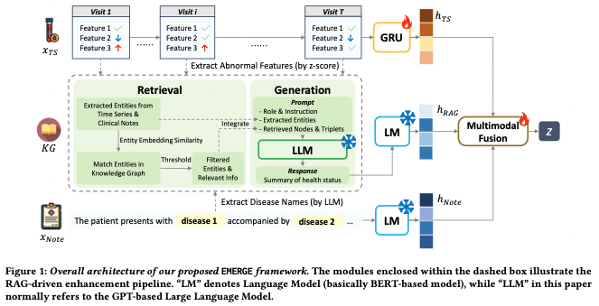

# EMERGE: Enhancing Multimodal Electronic Health Records Predictive Modeling with Retrieval-Augmented Generation
Zhu et al. (2024)  
Paper: https://dl.acm.org/doi/pdf/10.1145/3627673.3679582

## Original prompt template for summary generation

**Instruction**  
As an experienced clinical professor, you have been provided with the following information to assist in summarizing a patient's health status:

- Potential abnormal features exhibited by the patient
- Possible diseases the patient may be suffering from
- Definitions and descriptions of the corresponding diseases
- Knowledge graph triples specific to these diseases

Using this information, please create a concise and clear summary of the patient's health status. Your summary should be informative and beneficial for various healthcare prediction tasks, such as in-hospital mortality prediction and 30-day readmission prediction. Please provide your summary directly without any additional explanations.

**Potential abnormal features**  
Blood pressure too high, blood urea nitrogen too low, ...

**Potential diseases**  
['headache', 'flu', 'chest pain', ...]

**Diseases definition and description**  
[disease name]headache disorder [definition]Various conditions with the symptom of headache... [description]Headache disorders are classified into major groups, such as primary headache...  
[disease name]influenza [definition]An acute viral infection...

**Disease relationships**  
(headache disorder, indication, Acetaminophen),
(headache disorder, parent-child, intracranial hypotension),
(influenza, associated with, PARP12)...

## Modified version of the prompt for use in the PULSE benchmark
### Prompt #1

As an experienced clinical professor, you have been provided with the following information to assist in summarizing a patient's health status:

You are an experienced clinical professor, given some diseases that one patient suffered from and related documents and knowledge graph triples of these diseases, which may help you understand them better. Please try your best to summary the health condition of this patient and draw a brief conclusion in 512 tokens. You donnot need to explain or give interpretation of given terms.
[Diseases]

- Potential abnormal features exhibited by the patient
- Definitions and descriptions of of a common ICU complication: death/acute kidney injury/sepsis

Using this information, please create a concise and clear summary of the patient's health status. Your summary should be informative and beneficial for  the prediction of ICU mortality/prediction of the onset of acute kidney injury/sepsis. Please provide your summary directly without any additional explanations. 

**Potential abnormal features**  
Blood pressure too high, blood urea nitrogen too low, ...

**Complication definition and description**  
**[task=mortality]** Mortality refers to the occurrence of death within a specific population and time period. In the context of ICU patients, the task involves analyzing information from the first 25 hours of a patient’s ICU stay to predict whether the patient will survive the remainder of their stay. This prediction task supports early risk assessment and clinical decision-making in critical care settings.

**[task=aki, source: KDIGO 2012]** Acute kidney injury (AKI) is a subset of acute kidney diseases and disorders (AKD), characterized by a rapid decline in kidney function occurring within 7 days, with health implications. According to KDIGO criteria, AKI is diagnosed when there is an increase in serum creatinine to ≥1.5 times baseline within the prior 7 days, or an increase in serum creatinine by ≥0.3 mg/dL (≥26.5 µmol/L) within 48 hours, or urine output <0.5 mL/kg/h for 6–12 hours. The most common causes of AKI include sepsis, ischemia from hypotension or shock, and nephrotoxic exposures such as certain medications or contrast agents.

**[task=sepsis, source: Singer Sepsis-3 2016]** Sepsis is a life-threatening condition characterized by organ dysfunction resulting from a dysregulated host response to infection. It is diagnosed when a suspected or confirmed infection is accompanied by an acute increase of two or more points in the patient’s Sequential Organ Failure Assessment (SOFA) score relative to their baseline. The SOFA score evaluates six physiological parameters: the ratio of partial pressure of oxygen to the fraction of inspired oxygen, mean arterial pressure, serum bilirubin concentration, platelet count, serum creatinine level, and the Glasgow Coma Score. A complication of sepsis is septic shock, which is marked by a drop in blood pressure and elevated lactate levels. Indicators of suspected infection may include positive blood cultures or the initiation of antibiotic therapy.